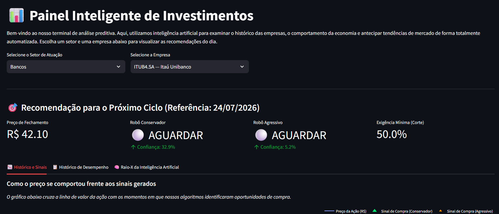
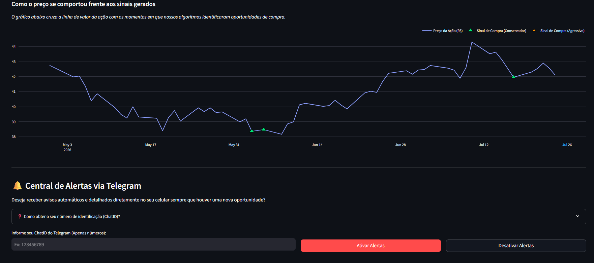
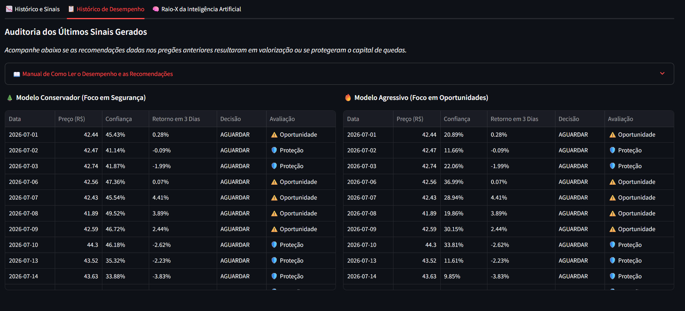
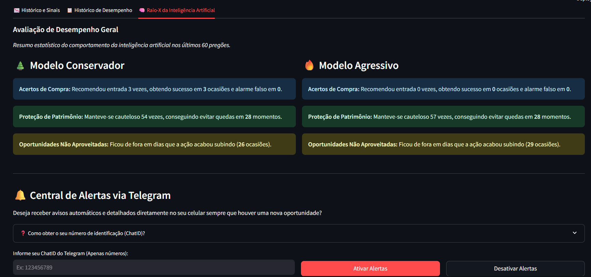

# 📊 Intelligent Investment Dashboard

> Automated quantitative analysis and market monitoring platform powered by Artificial Intelligence and Machine Learning.

---

## About the Project

The **Intelligent Investment Dashboard** is an end-to-end platform designed to help investors and analysts monitor financial assets from the Brazilian stock market (B3), including sectors such as Energy, Mining, and Technology.

The system combines automated data collection, database management, machine learning models, and interactive dashboards to analyze market behavior and generate predictive insights.

Using statistical models and machine learning algorithms (**Random Forest and XGBoost**), the platform processes technical indicators and macroeconomic data to identify potential market trends and provide automated signals through a web dashboard and Telegram notifications.

---

## System Architecture and Features

The project was designed with a modular, scalable architecture using a relational cloud database (**Supabase**).

### Web Dashboard (`dashboard.py`)

Built with **Streamlit**, the dashboard provides:

* **Dynamic Filters and Data Selection**
  * Automated selection of market sectors and companies directly from the database.

* **Historical Analysis and Trading Signals**
  * Interactive Plotly visualizations showing asset price movements and moments where the AI model detected potential opportunities.

* **Performance Analysis and Backtesting**
  * Historical evaluation of generated signals, including:
    * Correct predictions
    * Incorrect predictions
    * Risk protection analysis
    * Opportunity detection
    * Dynamic decision thresholds

* **AI Performance Monitoring**
  * Model accuracy analysis and comparison between conservative and aggressive strategies.

* **Automated Alert System**
  * Telegram integration allowing users to subscribe and receive personalized market notifications.

---

## Backend and Artificial Intelligence Pipeline

### Data Collection (`coleta.py`)

Automated pipeline responsible for collecting:

* Historical stock market data
* Currency information
* Commodity indicators
* Macroeconomic variables

---

### Machine Learning Pipeline (`treina_modelo.py`)

Complete training workflow responsible for:

* Data preprocessing
* Feature engineering
* Machine learning model training
* Adaptive predictive models by sector
* Dynamic threshold optimization

Models implemented:

* Random Forest
* XGBoost

---

### Telegram Automation Bot (`robo_telegram.py`)

Autonomous notification system responsible for:

* Generating sector reports
* Formatting analytical summaries
* Sending automated alerts directly to registered users

---

## 🖼️ Platform Demonstration

---

## Technologies Used

* **Python** - Main programming language
* **Streamlit** - Interactive web dashboard
* **Scikit-Learn & XGBoost** - Machine Learning models
* **Plotly** - Interactive data visualization
* **Supabase** - Cloud relational database
* **Telegram API** - Automated notification system
* **GitHub Actions** - Workflow automation and scheduled pipelines

---

## Key Skills Demonstrated

✔ Python Development  
✔ Machine Learning Pipeline Development  
✔ Data Collection Automation  
✔ Data Processing and Feature Engineering  
✔ Database Integration  
✔ Dashboard Development  
✔ API Integration  
✔ Automated Reporting Systems

#### Versão em português
# 📊 Painel Inteligente de Investimentos

> Terminal quantitativo de análise preditiva e monitoramento setorial automatizado por Inteligência Artificial e Machine Learning.

---

## Sobre o Projeto
O **Painel Inteligente de Investimentos** é uma plataforma desenvolvida para auxiliar investidores e analistas no acompanhamento de ativos da B3 (como Energia, Mineração e Tecnologia). Utilizando modelos estatísticos e aprendizado de máquina (*Random Forest* e *XGBoost*), o sistema processa indicadores macroeconômicos e técnicos para antecipar tendências de mercado, oferecendo recomendações claras de forma automatizada tanto via web quanto por um bot no Telegram.

---

## Estrutura de Páginas e Arquitetura do Sistema

O projeto foi estruturado para ser modular, dinâmico e escalável através de um banco de dados relacional (Supabase):

* **`dashboard.py` (Interface Web - Streamlit):**
  * **Cabeçalho e Filtros Dinâmicos:** Seleção automatizada de setores e empresas direto da base de dados.
  * **Aba 1 (Histórico e Sinais):** Gráficos interativos (Plotly) cruzando a linha de preço com os momentos exatos em que a I.A. identificou oportunidades.
  * **Aba 2 (Histórico de Desempenho & Manual):** Auditoria dos últimos sinais com uma tabela de backtest e um **manual explicativo detalhado** esclarecendo os conceitos de *Acerto*, *Erro*, *Proteção*, *Oportunidade* e a *Exigência Mínima (Threshold)*.
  * **Aba 3 (Raio-X da I.A.):** Estatísticas gerais de precisão, controle de risco e eficácia dos robôs (Conservador vs. Agressivo).
  * **Central de Alertas:** Inscrição e cancelamento instantâneo de notificações via Telegram utilizando o ChatID do usuário.

* **Scripts de Backend e Inteligência:**
  * **`coleta.py`:** Coleta automatizada de dados históricos de ativos, moedas e commodities.
  * **`treina_modelo.py`:** Esteira de machine learning que treina comitês preditivos adaptativos por setor e define limiares de corte dinâmicos.
  * **`robo_telegram.py`:** Robô autônomo responsável por disparar relatórios setoriais formatados diretamente para o celular dos usuários cadastrados.

---

## 🖼️ Demonstração da Plataforma

---

## Tecnologias Utilizadas
* **Python** (Linguagem principal)
* **Streamlit** (Interface gráfica web)
* **Scikit-Learn & XGBoost** (Modelos preditivos de Machine Learning)
* **Plotly** (Visualização avançada de dados)
* **Supabase** (Banco de dados em nuvem)
* **API do Telegram** (Canal de notificações automatizadas)
* **GitHub Actions** (Automação de rotinas e pipelines)
